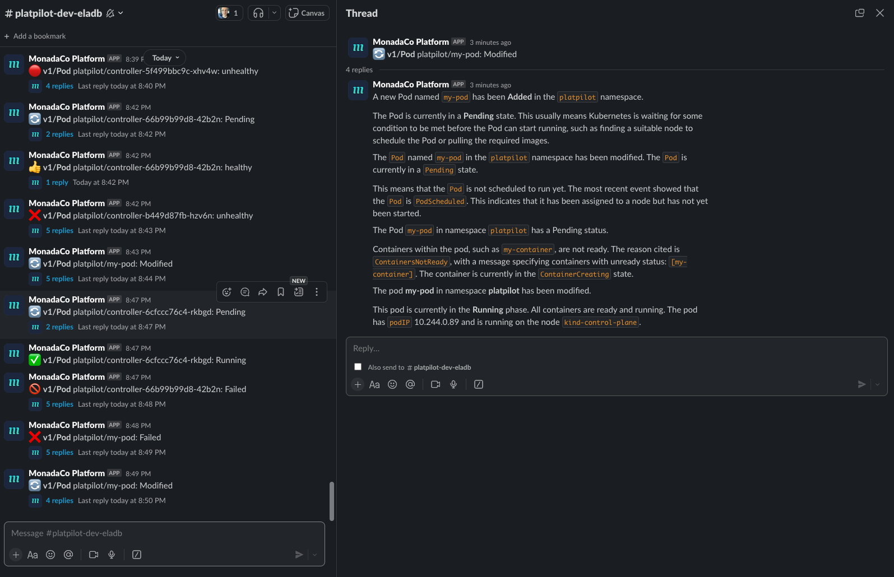

# git-operator

> An experiment.

It is currently listening to `Pod` events in the `git-operator` namespace and sends updates about status changes
on Slack:



## Cluster Setup

This uses the same setup as [kblocks](https://github.com/winglang/kblocks).

TL;DR:

Run
[`./scripts/reinstall-kind.sh`](https://github.com/winglang/kblocks/blob/main/scripts/reinstall-kind.sh)
and then
[`./scripts/kubectl-local.sh`](https://github.com/winglang/kblocks/blob/main/scripts/kubectl-local.sh).

See: [docs](https://github.com/winglang/kblocks/blob/main/docs/cluster.md) in the kblocks project.

## Where is the code?

The entrypoint is the `main()` function in `src/hook.ts`. Go wild!

## How to run?

```sh
$ npm i
$ npm run deploy
```

Slack messages will be sent to `#git-operator-dev-$USER`. You need to invite `MonadaCo Platform` to
this channel in order to receive messages.

## How to add dependencies?

Edit `.projenrc.ts` and run `npx projen`. Yes.

## How to update the Kubernetes configuration?

The k8s configuration of this operator is defined under `projenrc/deploy.ts`.
After changing the code there or in `.projenrc.ts`, you must run `npx projen` in order to update the tasks.

